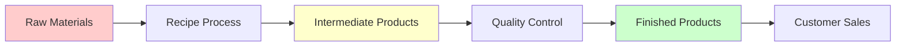

# 🏭 Bakery Inventory Management - Modules Documentation

## Overview

This document provides a comprehensive overview of the main modules in the bakery inventory management system, explaining their purpose, relationships, and key differences.

## 📊 System Architecture

```
┌─────────────────┐    ┌─────────────────┐    ┌─────────────────┐
│   Frontend      │    │    Backend      │    │   Database      │
│   (React TS)    │◄──►│  (Express TS)   │◄──►│  (PostgreSQL)   │
│   Material-UI   │    │   Prisma ORM    │    │   with Prisma   │
└─────────────────┘    └─────────────────┘    └─────────────────┘
```

---

## 🧩 Core Modules

### 1. 👤 User Management Module
**Purpose:** Authentication and authorization system

**Features:**
- User registration and login
- Role-based access control (ADMIN, MANAGER, STAFF, VIEWER)
- Session management
- Password hashing and security

**Database Model:**
```typescript
User {
  id: String (Primary Key)
  email: String (Unique)
  passwordHash: String
  role: UserRole (Enum)
  firstName: String
  lastName: String
  createdAt: DateTime
  updatedAt: DateTime
}
```

### 2. 🏷️ Category Management Module
**Purpose:** Hierarchical classification system for all inventory items

**Features:**
- Category creation and management
- Type-specific categories (RAW_MATERIAL, INTERMEDIATE, FINISHED_PRODUCT, RECIPE)
- Hierarchical organization
- Category-based reporting

**Database Model:**
```typescript
Category {
  id: String (Primary Key)
  name: String
  type: CategoryType (Enum)
  description: String
  createdAt: DateTime
}
```

**Category Types:**
- `RAW_MATERIAL` - For ingredients and base materials
- `INTERMEDIATE` - For work-in-progress products
- `FINISHED_PRODUCT` - For sellable final products
- `RECIPE` - For production instructions

### 3. 🏢 Supplier Management Module
**Purpose:** External vendor and supplier relationship management

**Features:**
- Supplier information tracking
- Contact management
- Active/inactive status
- Purchase history linking

**Database Model:**
```typescript
Supplier {
  id: String (Primary Key)
  name: String
  contactInfo: String
  address: String
  isActive: Boolean
  createdAt: DateTime
  updatedAt: DateTime
}
```

### 4. 📦 Storage Location Module
**Purpose:** Physical inventory location management

**Features:**
- Warehouse and storage area tracking
- Capacity management
- Location-based inventory reports
- Multi-location support

**Database Model:**
```typescript
StorageLocation {
  id: String (Primary Key)
  name: String
  type: String
  description: String
  capacity: String
  createdAt: DateTime
}
```

### 5. 📏 Units Management Module
**Purpose:** Standardized measurement system

**Features:**
- Weight, volume, and count units
- Unit conversion capabilities
- Active/inactive unit management
- Category-based unit organization

**Database Model:**
```typescript
Unit {
  id: String (Primary Key)
  name: String (Unique)
  symbol: String (Unique)
  category: String // "weight", "volume", "count"
  description: String
  isActive: Boolean
  createdAt: DateTime
  updatedAt: DateTime
}
```

**Unit Categories:**
- **Weight:** kg, g, lb, oz
- **Volume:** L, mL, gal, cup
- **Count:** pcs, dozen, case

---

## 🍞 Product Management Modules

### 6. 🥬 Raw Materials Module
**Purpose:** Base ingredients and materials inventory management

**Key Features:**
- Purchase tracking and supplier linking
- Expiration date monitoring
- Contamination status tracking
- Reorder level alerts
- Batch number tracking

**Business Logic:**
- **Input to production process**
- Cannot be sold directly to customers
- Requires supplier sourcing
- Subject to contamination checks
- Has purchase prices, not sale prices

**Database Model:**
```typescript
RawMaterial {
  id: String (Primary Key)
  name: String
  description: String
  categoryId: String (Foreign Key → Category)
  supplierId: String (Foreign Key → Supplier)
  batchNumber: String
  purchaseDate: DateTime
  expirationDate: DateTime
  quantity: Float
  unit: String
  unitPrice: Float
  reorderLevel: Float
  storageLocationId: String (Foreign Key → StorageLocation)
  isContaminated: Boolean
  createdAt: DateTime
  updatedAt: DateTime
}
```

**Real-world Examples:**
- Flour, sugar, eggs, butter
- Yeast, baking powder, salt
- Packaging materials, labels

### 7. 🔄 Intermediate Products Module
**Purpose:** Work-in-progress items during production

**Key Features:**
- Production status tracking
- Quality control workflow
- Recipe linking
- Batch production management
- Contamination monitoring

**Business Logic:**
- **Semi-finished goods** in production pipeline
- Cannot be sold to customers
- Require further processing
- Subject to quality approval
- Track production workflow status

**Database Model:**
```typescript
IntermediateProduct {
  id: String (Primary Key)
  name: String
  description: String
  categoryId: String (Foreign Key → Category)
  batchNumber: String (Unique)
  productionDate: DateTime
  expirationDate: DateTime
  quantity: Float
  unit: String
  storageLocationId: String (Foreign Key → StorageLocation)
  status: IntermediateProductStatus (Enum)
  contaminated: Boolean
  qualityStatus: QualityStatus (Enum)
  recipeId: String (Foreign Key → Recipe)
  createdAt: DateTime
  updatedAt: DateTime
}
```

**Status Values:**
- `IN_PRODUCTION` - Currently being made
- `COMPLETED` - Ready for next step
- `ON_HOLD` - Paused production
- `DISCARDED` - Failed quality check

**Quality Status:**
- `PENDING` - Awaiting quality check
- `APPROVED` - Passed quality control
- `REJECTED` - Failed quality control
- `UNDER_REVIEW` - Being evaluated

**Real-world Examples:**
- Mixed bread dough (before baking)
- Cake layers (before assembly)
- Cookie dough (before cutting/baking)
- Pastry shells (before filling)

### 8. ✅ Finished Products Module
**Purpose:** Completed, sellable products ready for customers

**Key Features:**
- SKU management for retail
- Sales price tracking
- Reserved quantity for orders
- Shelf life monitoring
- Production cost analysis
- Packaging information

**Business Logic:**
- **Final products** ready for sale
- Have customer sale prices
- Can be reserved for orders
- Completed production process
- Revenue-generating inventory

**Database Model:**
```typescript
FinishedProduct {
  id: String (Primary Key)
  name: String
  description: String
  sku: String (Unique)
  categoryId: String (Foreign Key → Category)
  batchNumber: String
  productionDate: DateTime
  expirationDate: DateTime
  shelfLife: Int (Days)
  quantity: Float
  reservedQuantity: Float
  unit: String
  salePrice: Float
  costToProduce: Float
  packagingInfo: String
  storageLocationId: String (Foreign Key → StorageLocation)
  createdAt: DateTime
  updatedAt: DateTime
}
```

**Real-world Examples:**
- Finished loaves of bread
- Decorated cakes ready for pickup
- Packaged cookies for display
- Croissants ready for sale

### 9. 📋 Recipe Module
**Purpose:** Production instructions and yield management

**Features:**
- Step-by-step instructions
- Yield quantity calculation
- Preparation time tracking
- Recipe categorization
- Intermediate product linking

**Database Model:**
```typescript
Recipe {
  id: String (Primary Key)
  name: String
  description: String
  categoryId: String (Foreign Key → Category)
  yieldQuantity: Float
  yieldUnit: String
  prepTime: Int (Minutes)
  instructions: Json (Array of steps)
  createdAt: DateTime
  updatedAt: DateTime
}
```

---

## 🔄 Product Lifecycle Flow



### Production Workflow:
1. **Raw Materials** are purchased from suppliers
2. **Recipes** define how to combine raw materials
3. **Intermediate Products** are created during production
4. **Quality Control** approves intermediate products
5. **Finished Products** are completed and ready for sale
6. **Sales** generate revenue from finished products

---

## 🔑 Key Differences Summary

| Aspect | Raw Materials | Intermediate Products | Finished Products |
|--------|---------------|----------------------|-------------------|
| **Purpose** | Input ingredients | Work-in-progress | Sellable items |
| **Sales Status** | Cannot sell | Cannot sell | Ready for sale |
| **Pricing** | Purchase price | No price | Sale price |
| **Status Tracking** | Contamination only | Production workflow | No status needed |
| **Quality Control** | Contamination check | Full QC process | QC completed |
| **SKU** | No SKU | No SKU | Unique SKU |
| **Reservations** | No reservations | No reservations | Can be reserved |
| **Supplier** | Required | Not applicable | Not applicable |
| **Recipe Link** | Not applicable | Required | Not applicable |
| **Shelf Life** | Expiration date | Expiration date | Shelf life in days |

---

## 🛠️ Technical Implementation

### Frontend Structure:
```
src/
├── components/
│   ├── Auth/           # User authentication
│   ├── Layout/         # App layout and navigation
│   └── Settings/       # Units and configuration
├── pages/
│   ├── RawMaterials.tsx        # Raw materials management
│   ├── IntermediateProducts.tsx # WIP products
│   ├── FinishedProducts.tsx    # Final products
│   ├── Recipes.tsx             # Recipe management
│   └── Settings.tsx            # System configuration
└── services/
    ├── api.ts          # API client
    ├── realApi.ts      # Real database API
    └── mockApi.ts      # Mock data for testing
```

### Backend Structure:
```
src/
├── controllers/        # Route handlers for each module
├── routes/            # Express route definitions
├── middleware/        # Authentication and error handling
├── services/          # Business logic layer
└── types/             # TypeScript type definitions
```

### Database Relationships:
- All product types link to **Categories** for classification
- Raw materials link to **Suppliers** for sourcing
- All products link to **Storage Locations** for tracking
- Intermediate products link to **Recipes** for production
- **Units** provide consistent measurement across all modules

---

## 🎯 Development Status

| Module | Status | Features |
|--------|--------|----------|
| User Management | 🟡 Partial | Authentication framework ready |
| Categories | ✅ Complete | Full CRUD operations |
| Suppliers | ✅ Complete | Full CRUD operations |
| Storage Locations | ✅ Complete | Full CRUD operations |
| Units | ✅ Complete | Full CRUD with UI |
| Raw Materials | 🟡 Partial | Backend ready, UI pending |
| Intermediate Products | ✅ Complete | Full CRUD with professional UI |
| Finished Products | 🟡 Partial | Backend ready, UI pending |
| Recipes | 🟡 Partial | Backend ready, UI pending |

**Legend:**
- ✅ Complete: Fully implemented with UI
- 🟡 Partial: Backend ready, UI in development
- 🔴 Pending: Not yet implemented

---

## 🚀 Next Development Steps

1. **Complete Raw Materials UI** - Build comprehensive management interface
2. **Finished Products UI** - Implement sales-ready product management
3. **Recipe Management UI** - Create recipe builder and management
4. **Advanced Reporting** - Cross-module analytics and insights
5. **Production Planning** - Workflow optimization tools
6. **Mobile Responsiveness** - Optimize for tablet/mobile use

This modular architecture ensures scalability, maintainability, and clear separation of concerns across the entire bakery inventory management system.
