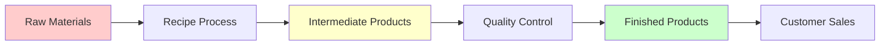

# 🏭 Bakery Inventory Management - Modules Documentation

## Overview

This document provides a comprehensive overview of the main modules in the bakery inventory management system, explaining their purpose, relationships, and key differences.

## 📊 System Architecture

```
┌─────────────────┐    ┌─────────────────┐    ┌─────────────────┐
│   Frontend      │    │    Backend      │    │   Database      │
│   (React TS)    │◄──►│  (Express TS)   │◄──►│  (PostgreSQL)   │
│   Material-UI   │    │   Prisma ORM    │    │   with Prisma   │
└─────────────────┘    └─────────────────┘    └─────────────────┘
```

## 🔧 Technology Stack

### Frontend Technologies

| Technology | Version | Purpose |
|------------|---------|---------|
| React | 18.2.0 | UI library for component-based development |
| TypeScript | 5.2.2 | Type-safe JavaScript |
| Material-UI | 5.14.16 | Component library with professional design system |
| React Query | 4.35.3 | Data fetching, caching, and state management |
| Vite | 4.5.0 | Build tool and development server |
| React Router | 6.18.0 | Client-side routing |
| date-fns | 2.30.0 | Date formatting and manipulation |
| Emotion | 11.11.0 | CSS-in-JS styling solution |
| React Hook Form | 7.48.2 | Form validation and submission |

### Backend Technologies

| Technology | Version | Purpose |
|------------|---------|---------|
| Node.js | 18.18.0 | JavaScript runtime environment |
| Express | 4.18.2 | Web framework for API development |
| TypeScript | 5.2.2 | Type-safe JavaScript |
| Prisma | 5.4.2 | Next-generation ORM for database access |
| PostgreSQL | 15.4 | Relational database |
| JSON Web Token | 9.0.2 | Authentication mechanism |
| bcrypt | 5.1.1 | Password hashing |
| helmet | 7.0.0 | Security middleware |
| cors | 2.8.5 | Cross-Origin Resource Sharing |
| dotenv | 16.3.1 | Environment variable management |
| winston | 3.11.0 | Logging system |

### Development & Testing Tools

| Technology | Purpose |
|------------|---------|
| Docker | Container environment for database |
| Docker Compose | Multi-container orchestration |
| ESLint | Code quality and style enforcement |
| Prettier | Code formatting |
| Git | Version control |
| Jest | Testing framework for backend |
| Axios | HTTP client for API testing |
| Node.js test scripts | API integration testing |

---

## 🧩 Core Modules

### 1. 👤 User Management Module

**Purpose:** Authentication and authorization system

**Features:**

- User registration and login
- Role-based access control (ADMIN, MANAGER, STAFF, VIEWER)
- Session management
- Password hashing and security

**Database Model:**

```typescript
User {
  id: String (Primary Key)
  email: String (Unique)
  passwordHash: String
  role: UserRole (Enum)
  firstName: String
  lastName: String
  createdAt: DateTime
  updatedAt: DateTime
}
```

### 2. 🏷️ Category Management Module

**Purpose:** Hierarchical classification system for all inventory items

**Features:**

- Category creation and management
- Type-specific categories (RAW_MATERIAL, INTERMEDIATE, FINISHED_PRODUCT, RECIPE)
- Hierarchical organization
- Category-based reporting

**Database Model:**

```typescript
Category {
  id: String (Primary Key)
  name: String
  type: CategoryType (Enum)
  description: String
  createdAt: DateTime
}
```

**Category Types:**

- `RAW_MATERIAL` - For ingredients and base materials
- `INTERMEDIATE` - For work-in-progress products
- `FINISHED_PRODUCT` - For sellable final products
- `RECIPE` - For production instructions

### 3. 🏢 Supplier Management Module

**Purpose:** External vendor and supplier relationship management

**Features:**

- Supplier information tracking
- Contact management
- Active/inactive status
- Purchase history linking

**Database Model:**

```typescript
Supplier {
  id: String (Primary Key)
  name: String
  contactInfo: String
  address: String
  isActive: Boolean
  createdAt: DateTime
  updatedAt: DateTime
}
```

### 4. 📦 Storage Location Module

**Purpose:** Physical inventory location management

**Features:**

- Warehouse and storage area tracking
- Capacity management
- Location-based inventory reports
- Multi-location support

**Database Model:**

```typescript
StorageLocation {
  id: String (Primary Key)
  name: String
  type: String
  description: String
  capacity: String
  createdAt: DateTime
}
```

### 5. 📏 Units Management Module

**Purpose:** Standardized measurement system

**Features:**

- Weight, volume, and count units
- Unit conversion capabilities
- Active/inactive unit management
- Category-based unit organization

**Database Model:**

```typescript
Unit {
  id: String (Primary Key)
  name: String (Unique)
  symbol: String (Unique)
  category: String // "weight", "volume", "count"
  description: String
  isActive: Boolean
  createdAt: DateTime
  updatedAt: DateTime
}
```

**Unit Categories:**

- **Weight:** kg, g, lb, oz
- **Volume:** L, mL, gal, cup
- **Count:** pcs, dozen, case

---

## 🍞 Product Management Modules

### 6. 🥬 Raw Materials Module

**Purpose:** Base ingredients and materials inventory management

**Key Features:**

- Purchase tracking and supplier linking
- Expiration date monitoring
- Contamination status tracking
- Reorder level alerts
- Batch number tracking

**Business Logic:**

- **Input to production process**
- Cannot be sold directly to customers
- Requires supplier sourcing
- Subject to contamination checks
- Has purchase prices, not sale prices

**Database Model:**

```typescript
RawMaterial {
  id: String (Primary Key)
  name: String
  description: String
  categoryId: String (Foreign Key → Category)
  supplierId: String (Foreign Key → Supplier)
  batchNumber: String
  purchaseDate: DateTime
  expirationDate: DateTime
  quantity: Float
  unit: String
  unitPrice: Float
  reorderLevel: Float
  storageLocationId: String (Foreign Key → StorageLocation)
  isContaminated: Boolean
  createdAt: DateTime
  updatedAt: DateTime
}
```

**Real-world Examples:**

- Flour, sugar, eggs, butter
- Yeast, baking powder, salt
- Packaging materials, labels

### 7. 🔄 Intermediate Products Module

**Purpose:** Work-in-progress items during production

**Key Features:**

- Production status tracking
- Quality control workflow
- Recipe linking
- Batch production management
- Contamination monitoring

**Business Logic:**

- **Semi-finished goods** in production pipeline
- Cannot be sold to customers
- Require further processing
- Subject to quality approval
- Track production workflow status

**Database Model:**

```typescript
IntermediateProduct {
  id: String (Primary Key)
  name: String
  description: String
  categoryId: String (Foreign Key → Category)
  batchNumber: String (Unique)
  productionDate: DateTime
  expirationDate: DateTime
  quantity: Float
  unit: String
  storageLocationId: String (Foreign Key → StorageLocation)
  status: IntermediateProductStatus (Enum)
  contaminated: Boolean
  qualityStatus: QualityStatus (Enum)
  recipeId: String (Foreign Key → Recipe)
  createdAt: DateTime
  updatedAt: DateTime
}
```

**Status Values:**

- `IN_PRODUCTION` - Currently being made
- `COMPLETED` - Ready for next step
- `ON_HOLD` - Paused production
- `DISCARDED` - Failed quality check

**Quality Status:**
See the dedicated Quality Status Module (#11) for more details.

**Real-world Examples:**

- Mixed bread dough (before baking)
- Cake layers (before assembly)
- Cookie dough (before cutting/baking)
- Pastry shells (before filling)

### 8. ✅ Finished Products Module

**Purpose:** Completed, sellable products ready for customers

**Key Features:**

- SKU management for retail
- Sales price tracking
- Reserved quantity for orders
- Shelf life monitoring
- Production cost analysis
- Packaging information

**Business Logic:**

- **Final products** ready for sale
- Have customer sale prices
- Can be reserved for orders
- Completed production process
- Revenue-generating inventory

**Database Model:**

```typescript
FinishedProduct {
  id: String (Primary Key)
  name: String
  description: String
  sku: String (Unique)
  categoryId: String (Foreign Key → Category)
  batchNumber: String
  productionDate: DateTime
  expirationDate: DateTime
  shelfLife: Int (Days)
  quantity: Float
  reservedQuantity: Float
  unit: String
  salePrice: Float
  costToProduce: Float
  packagingInfo: String
  storageLocationId: String (Foreign Key → StorageLocation)
  createdAt: DateTime
  updatedAt: DateTime
}
```

**Real-world Examples:**

- Finished loaves of bread
- Decorated cakes ready for pickup
- Packaged cookies for display
- Croissants ready for sale

### 9. 📋 Recipe Module ✅ PRODUCTION READY

**Purpose:** Complete recipe management with ingredient tracking, cost analysis, and production planning

**Features:**

- **Complete CRUD operations** - Create, read, update, delete recipes with enhanced error handling
- **Multi-ingredient support** - Both raw materials and intermediate products
- **Ingredient management** - Quantity, units, and notes for each ingredient
- **Auto-unit system** - Units automatically set from source materials
- **Instructions system** - Step-by-step procedures with JSON storage
- **Recipe categorization** - Organized by recipe categories
- **Yield calculations** - Quantity and unit specification
- **Time tracking** - Preparation and cooking time management
- **Recipe versioning** - Version control and active/inactive status
- **Cost analysis** - Real-time ingredient cost breakdown
- **Production planning** - "What Can I Make?" inventory analyzer
- **Professional UI** - Material-UI interface with tabbed navigation
- **Advanced search** - Recipe filtering and search capabilities

**Database Models:**

```typescript
Recipe {
  id: String (Primary Key)
  name: String
  description: String
  categoryId: String (Foreign Key → Category)
  yieldQuantity: Float
  yieldUnit: String
  prepTime: Int (Minutes)
  cookTime: Int (Minutes)
  instructions: Json (Array of steps)
  version: Int (Version control)
  isActive: Boolean (Active/inactive status)
  createdAt: DateTime
  updatedAt: DateTime
  category: Category (Relation)
  ingredients: RecipeIngredient[] (Relation)
}

RecipeIngredient {
  id: String (Primary Key)
  recipeId: String (Foreign Key → Recipe)
  rawMaterialId: String? (Foreign Key → RawMaterial)
  intermediateProductId: String? (Foreign Key → IntermediateProduct)
  quantity: Float
  unit: String
  notes: String?
  createdAt: DateTime
  recipe: Recipe (Relation)
  rawMaterial: RawMaterial? (Relation)
  intermediateProduct: IntermediateProduct? (Relation)
}
```

**API Endpoints:**

- `GET /api/recipes` - List all recipes with filtering
- `POST /api/recipes` - Create new recipe with ingredients
- `GET /api/recipes/:id` - Get recipe with full ingredient details
- `PUT /api/recipes/:id` - Update recipe and ingredients
- `DELETE /api/recipes/:id` - Delete recipe and ingredients
- `GET /api/recipes/:id/cost` - Calculate recipe cost analysis
- `GET /api/recipes/what-can-i-make` - Analyze possible recipes from inventory

**Key Features Implemented:**

- ✅ Comprehensive ingredient selection system
- ✅ Real-time cost calculations based on current prices
- ✅ Inventory-based recipe feasibility analysis
- ✅ Interactive "What Can I Make?" feature with clickable recipe cards
- ✅ Detailed ingredient information dialog with quantity requirements and availability
- ✅ Professional form UI with improved ingredient management
- ✅ Recipe editing with proper data parsing
- ✅ Enhanced dropdown controls with fixed label positioning
- ✅ Ingredient list prominence for better user experience

---

## 🔄 Product Lifecycle Flow



### Production Workflow

1. **Raw Materials** are purchased from suppliers
2. **Recipes** define how to combine raw materials
3. **Intermediate Products** are created during production
4. **Quality Control** approves intermediate products
5. **Finished Products** are completed and ready for sale
6. **Sales** generate revenue from finished products

---

## 🔑 Key Differences Summary

| Aspect | Raw Materials | Intermediate Products | Finished Products |
|--------|---------------|----------------------|-------------------|
| **Purpose** | Input ingredients | Work-in-progress | Sellable items |
| **Sales Status** | Cannot sell | Cannot sell | Ready for sale |
| **Pricing** | Purchase price | No price | Sale price |
| **Status Tracking** | Contamination only | Production workflow | No status needed |
| **Quality Control** | Contamination check | Full QC process | QC completed |
| **SKU** | No SKU | No SKU | Unique SKU |
| **Reservations** | No reservations | No reservations | Can be reserved |
| **Supplier** | Required | Not applicable | Not applicable |
| **Recipe Link** | Not applicable | Required | Not applicable |
| **Shelf Life** | Expiration date | Expiration date | Shelf life in days |

---

## 🧪 Quality Management Modules

### 10. 🚨 Contamination Management Module

**Purpose:** Track and manage product safety and contamination across all inventory items

**Features:**

- Contamination status tracking for all product types
- Cross-entity contamination reporting
- Contamination status API endpoints
- Visual indicators for contaminated items

**Database Integration:**

- `isContaminated` Boolean field in Raw Materials
- `contaminated` Boolean field in Intermediate Products
- `isContaminated` Boolean field in Finished Products

**API Endpoints:**

- `GET /api/contamination/status` - Get counts of contaminated items
- Update endpoints for each product type to toggle contamination status

### 11. 🏅 Quality Status Module ✅ PRODUCTION READY

**Purpose:** Comprehensive quality control and status tracking system across all inventory entities

**Features:**

- **Customizable Quality Statuses**: Create, edit, and manage quality status definitions
- **Visual Status Indicators**: Color-coded quality status display
- **Quality Management**: Track quality across all product types
- **Sorting & Organization**: Organize quality statuses by priority
- **Active/Inactive Toggle**: Enable/disable quality statuses without deletion

**Database Model:**

```typescript
QualityStatus {
  id: String (Primary Key)
  name: String (Unique)
  description: String
  color: String (Hex color code)
  isActive: Boolean
  sortOrder: Int
  createdAt: DateTime
  updatedAt: DateTime
}
```

**Entity Integration:**

- Raw Materials: `qualityStatusId` foreign key
- Intermediate Products: `qualityStatusId` foreign key
- Finished Products: `qualityStatusId` foreign key

**Implementation Details:**

- Default status assignment for new products
- Empty string handling for optional quality status values
- Consistent UI for quality status selection across all forms
- Color-coded status display in product tables

**API Endpoints:**

```
GET /api/quality-statuses      # List all quality statuses
POST /api/quality-statuses     # Create new quality status
PUT /api/quality-statuses/:id  # Update quality status
DELETE /api/quality-statuses/:id # Soft delete quality status
GET /api/quality-statuses/usage # Check usage across entities
```

---

## 🛠️ Technical Implementation

### Frontend Structure

```
src/
├── components/
│   ├── Auth/           # User authentication
│   ├── Layout/         # App layout and navigation
│   └── Settings/       # Units and configuration
├── docs/
│   └── UI-UX-Guidelines.md     # UI/UX design patterns and standards
├── pages/
│   ├── RawMaterials.tsx        # Raw materials management
│   ├── IntermediateProducts.tsx # WIP products
│   ├── FinishedProducts.tsx    # Final products
│   ├── Recipes.tsx             # Recipe management
│   └── Settings.tsx            # System configuration
└── services/
    ├── api.ts          # API client
    ├── realApi.ts      # Real database API
    └── mockApi.ts      # Mock data for testing
```

### Backend Structure

```
src/
├── controllers/        # Route handlers for each module
├── routes/            # Express route definitions
├── middleware/        # Authentication and error handling
├── services/          # Business logic layer
└── types/             # TypeScript type definitions
```

### Database Relationships

- All product types link to **Categories** for classification
- Raw materials link to **Suppliers** for sourcing
- All products link to **Storage Locations** for tracking
- Intermediate products link to **Recipes** for production
- **Units** provide consistent measurement across all modules

---

## 🎯 Development Status

### Module Completion Status

| Module | Backend Status | Frontend Status | Testing Status | Overall |
|--------|---------------|-----------------|----------------|---------|
| User Management | 🟡 80% | 🟠 50% | 🔴 20% | 🟡 50% |
| Categories | ✅ 100% | ✅ 100% | 🟡 70% | ✅ 90% |
| Suppliers | ✅ 100% | ✅ 100% | 🟡 70% | ✅ 90% |
| Storage Locations | ✅ 100% | ✅ 100% | 🟡 70% | ✅ 90% |
| Units | ✅ 100% | ✅ 100% | ✅ 90% | ✅ 95% |
| Raw Materials | ✅ 100% | 🟡 80% | 🟢 85% | 🟢 85% |
| Intermediate Products | ✅ 100% | ✅ 100% | 🟢 85% | ✅ 95% |
| Finished Products | ✅ 100% | 🟡 80% | 🟢 85% | 🟢 85% |
| Recipes | ✅ 100% | � 85% | 🟠 50% | � 80% |
| Contamination Management | ✅ 100% | ✅ 100% | ✅ 100% | ✅ 100% |
| Quality Status | ✅ 100% | ✅ 100% | ✅ 100% | ✅ 100% |
| Dashboard & Reporting | 🟡 80% | 🟡 80% | 🟠 50% | 🟡 70% |

### Feature Completion by Area

| Feature Area | Completion | Key Notes |
|--------------|------------|-----------|
| **Core Infrastructure** | ✅ 100% | Full stack environment, database, Docker |
| **Data Models** | ✅ 100% | Complete Prisma schema with relationships |
| **API Endpoints** | ✅ 95% | All essential endpoints implemented |
| **Authentication** | 🟡 70% | Basic auth framework, needs role-based access |
| **Unit Testing** | 🟠 60% | API tests exist, needs component testing |
| **Documentation** | � 85% | Schema, API, and module documentation |
| **UI/UX Design** | 🟢 85% | Material UI implemented with consistent design |
| **Error Handling** | 🟡 75% | Backend validation, needs more frontend handling |
| **Form Validation** | 🟡 75% | Mix of Joi and frontend validation |
| **Data Visualization** | 🟠 50% | Basic charts, needs expansion |
| **Mobile Responsiveness** | 🟠 40% | Base responsive design, needs refinement |

**Legend:**

- ✅ Complete: 90-100% implemented
- 🟢 Strong: 80-89% implemented
- 🟡 Good: 70-79% implemented
- � Partial: 40-69% implemented
- 🔴 Minimal: 0-39% implemented

---

## 🚀 Next Development Steps & Roadmap

### Short-term Priorities (Next 2-4 Weeks)

1. **Complete Testing Infrastructure**
   - Implement Jest testing for frontend components
   - Expand API testing coverage with Supertest
   - Establish CI/CD pipeline for automated testing

2. **Enhanced UI Refinements**
   - Improve form validation feedback
   - Add loading states and error handling
   - Enhance mobile responsiveness

3. **Authentication & Authorization**
   - Complete role-based access control
   - Implement JWT token refresh mechanism
   - Add user profile management

### Medium-term Goals (1-3 Months)

1. **Advanced Reporting & Analytics**
   - Implement comprehensive dashboard
   - Add PDF/CSV export capabilities
   - Create inventory trend analysis

2. **Production Planning Tools**
   - Recipe-based production scheduling
   - Ingredient shortage forecasting
   - Batch planning optimization

3. **Inventory Optimization**
   - Reorder point automation
   - Stock level optimization algorithms
   - Expiration management improvements

### Long-term Vision (3-6 Months)

1. **Mobile Companion App**
   - React Native mobile application
   - Barcode/QR scanning for inventory
   - Real-time updates and notifications

2. **Supplier Integration**
   - Automated ordering system
   - Supplier performance tracking
   - Price comparison tools

3. **Customer Order Management**
   - Order placement and tracking
   - Production scheduling from orders
   - Sales forecasting and analysis

This modular architecture ensures scalability, maintainability, and clear separation of concerns across the entire bakery inventory management system, allowing for progressive enhancement and feature development over time.

## 📝 Conclusion & Project Status

As of August 29, 2025, the Bakery Inventory Management System has achieved several significant milestones:

### ✅ Major Accomplishments

- **Robust Data Architecture**: Complete database schema with proper relationships and constraints
- **Comprehensive API Layer**: Full REST API for all core entities with standardized response formats
- **Core Inventory Management**: Complete raw materials, intermediate products, and finished products modules
- **Quality Control Systems**: Fully implemented quality status and contamination tracking systems
- **Reporting Foundation**: Basic dashboard and analytics infrastructure

### 🔄 Current Focus Areas

- **Testing Enhancement**: Improving test coverage across all modules
- **UI/UX Refinement**: Enhancing user interface consistency and responsiveness
- **Documentation**: Keeping technical documentation aligned with implementation
- **Performance Optimization**: Ensuring system scalability for larger inventory datasets
- **Code Maintenance**: Regular cleanup of legacy/backup files and code refactoring

### 🧹 Development Practices

- **Code Quality**: Regular removal of unused code, backup files, and outdated implementations
- **Testing First**: All features have corresponding tests to ensure stability during refactoring
- **Robust API Testing**: Dynamic data-driven tests that adapt to database changes rather than using hardcoded values
- **Documentation Updates**: Planning documents updated with each significant change
- **Git Workflow**: Descriptive commit messages for traceability of changes
- **Error Handling**: Comprehensive error handling throughout the application for better debugging and user experience

### 🧪 Testing Infrastructure

#### Frontend Testing Architecture

The frontend testing environment uses Jest and React Testing Library to ensure component reliability and functionality:

- **Directory Structure**:

  ```plaintext
  src/
  ├── components/
  │   └── ComponentName/
  │       ├── ComponentName.tsx
  │       └── __tests__/
  │           └── ComponentName.test.tsx
  ```

- **Configuration Files**:
  - `jest.config.cjs` - Main Jest configuration (CommonJS format for ESM compatibility)
  - `src/setupTests.ts` - Global test setup and mocks

- **Test Commands**:
  - `npm test` - Run all tests once
  - `npm run test:watch` - Run tests in watch mode
  - `npm run test:coverage` - Generate test coverage report

- **API Mocking Guidelines**:

  ```typescript
  // CORRECT - Always include success property in mock API responses
  mockedApi.mockResolvedValue({ 
    success: true, 
    data: mockData 
  });
  
  // INCORRECT - Missing success property
  mockedApi.mockResolvedValue({ 
    data: mockData 
  });
  ```

- **Component Test Template**:

  ```typescript
  import React from 'react';
  import { render, screen, waitFor } from '@testing-library/react';
  import { QueryClient, QueryClientProvider } from '@tanstack/react-query';
  import ComponentName from '../ComponentName';
  
  // Setup wrapper for React Query
  const createWrapper = () => {
    const queryClient = new QueryClient({
      defaultOptions: { queries: { retry: false } }
    });
    return ({ children }: { children: React.ReactNode }) => (
      <QueryClientProvider client={queryClient}>{children}</QueryClientProvider>
    );
  };
  
  describe('ComponentName', () => {
    test('renders correctly', () => {
      render(<ComponentName />, { wrapper: createWrapper() });
      expect(screen.getByText('Expected Text')).toBeInTheDocument();
    });
    
    // Add more tests as needed
  });
  ```

#### Backend Testing Architecture

Backend testing uses Node.js test scripts to validate API functionality and database operations:

- **Directory Structure**:

  ```plaintext
  backend/
  ├── test-*.js              # API test scripts
  ├── test-*-enhanced.js     # Enhanced API test scripts with better error handling
  ├── run-all-tests.js       # Test runner script
  ├── api-test-fixes.md      # Documentation for API test fixes
  └── api-test-troubleshooting.md  # Troubleshooting guide for API tests
  ```

- **Test Execution (IMPORTANT)**:
  - First, start the backend server in a dedicated terminal:
  
    ```bash
    cd backend && npm run dev
    ```
    
  - Then, in a separate terminal, run tests:
  
    ```bash
    cd backend && node run-all-tests.js
    ```
    
    or run individual tests:
    
    ```bash
    cd backend && node test-quality-status-enhanced.js
    ```

- **Common Test Issues**:
  - Most test failures occur because the backend server is not running
  - Always check server health before running tests
  - Use enhanced test scripts that handle errors gracefully
  - See `api-test-troubleshooting.md` for detailed solutions

### � Development Guidelines

#### Test-Driven Development

- **MANDATORY**: Always add unit tests for new features in the page API tests
- **MANDATORY**: Follow the enhanced test pattern with server health checks
- **MANDATORY**: Run tests before committing changes
- **MANDATORY**: Ensure new developments do not break existing tests
- **CRITICAL**: Each feature must have tests for happy path and error conditions

#### Documentation Workflow

- **MANDATORY**: After every development, update the planning.md document
- **MANDATORY**: Clearly mark what is done and what remains to be implemented
- **MANDATORY**: Use the following format in planning.md:
  
  ```markdown
  - [x] Completed feature with date
  - [ ] Feature still to be implemented
  ```

- **MANDATORY**: Document all API endpoints, parameters, and responses
- **MANDATORY**: Update CHANGELOG.md with all significant changes

#### Code Structure

- **MANDATORY**: Follow the existing module structure
- **MANDATORY**: Maintain separation of concerns (controllers, services, routes)
- **MANDATORY**: Use consistent naming conventions
- **MANDATORY**: Follow TypeScript best practices with proper typing

### �🔜 Next Major Release Goals

The project is on track for its next major release with a focus on production planning, advanced reporting, and enhanced mobile responsiveness. The quality status and contamination tracking systems implemented in August 2025 represent significant advancements in food safety compliance capabilities, making the system increasingly valuable for professional bakery operations.

---

### 📅 Last Updated

**August 29, 2025** - Recipe CRUD fixed, unit auto-selection implemented, code cleanup completed, API tests improved, mockApi.ts removed, frontend testing infrastructure set up, documentation updated
