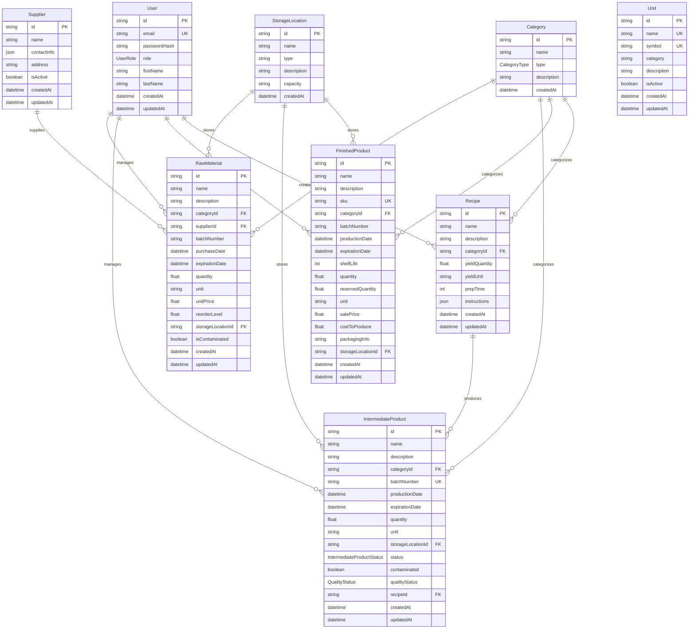

# Database Schema & Relationships

## Entity Relationship Diagram



## ASCII Art Version

```text
┌─────────────────┐    ┌─────────────────┐    ┌─────────────────┐
│      User       │    │    Category     │    │    Supplier     │
├─────────────────┤    ├─────────────────┤    ├─────────────────┤
│ id (PK)         │    │ id (PK)         │    │ id (PK)         │
│ email (UK)      │    │ name            │    │ name            │
│ passwordHash    │    │ type (enum)     │    │ contactInfo     │
│ role (enum)     │    │ description     │    │ address         │
│ firstName       │    │ createdAt       │    │ isActive        │
│ lastName        │    └─────────────────┘    │ createdAt       │
│ createdAt       │           │               │ updatedAt       │
│ updatedAt       │           │               └─────────────────┘
└─────────────────┘           │                        │
                              │                        │
        ┌─────────────────────┼────────────────────────┘
        │                     │
        │                     │
        ▼                     ▼
┌─────────────────┐    ┌─────────────────┐    ┌─────────────────┐
│  RawMaterial    │    │StorageLocation  │    │      Unit       │
├─────────────────┤    ├─────────────────┤    ├─────────────────┤
│ id (PK)         │    │ id (PK)         │    │ id (PK)         │
│ name            │    │ name            │    │ name (UK)       │
│ description     │    │ type            │    │ symbol (UK)     │
│ categoryId (FK) │────┤ description     │    │ category        │
│ supplierId (FK) │    │ capacity        │    │ description     │
│ batchNumber     │    │ createdAt       │    │ isActive        │
│ purchaseDate    │    └─────────────────┘    │ createdAt       │
│ expirationDate  │           │               │ updatedAt       │
│ quantity        │           │               └─────────────────┘
│ unit            │           │
│ unitPrice       │           │
│ reorderLevel    │           │
│ storageLocationId (FK)──────┘
│ isContaminated  │
│ createdAt       │
│ updatedAt       │
└─────────────────┘
        │
        │ (same structure pattern)
        ▼
┌─────────────────┐    ┌─────────────────┐
│IntermediateProduct   │   Recipe        │
├─────────────────┤    ├─────────────────┤
│ id (PK)         │    │ id (PK)         │
│ name            │    │ name            │
│ description     │    │ description     │
│ categoryId (FK) │────┤ categoryId (FK) │
│ batchNumber (UK)│    │ yieldQuantity   │
│ productionDate  │    │ yieldUnit       │
│ expirationDate  │    │ prepTime        │
│ quantity        │    │ instructions    │
│ unit            │    │ createdAt       │
│ storageLocationId (FK)│ updatedAt      │
│ status (enum)   │    └─────────────────┘
│ contaminated    │           │
│ qualityStatus   │           │ (1:many)
│ recipeId (FK)   │───────────┘
│ createdAt       │
│ updatedAt       │
└─────────────────┘
        │
        │ (similar structure)
        ▼
┌─────────────────┐
│ FinishedProduct │
├─────────────────┤
│ id (PK)         │
│ name            │
│ description     │
│ sku (UK)        │
│ categoryId (FK) │────┐
│ batchNumber     │    │
│ productionDate  │    │
│ expirationDate  │    │
│ shelfLife       │    │
│ quantity        │    │
│ reservedQuantity│    │
│ unit            │    │
│ salePrice       │    │
│ costToProduce   │    │
│ packagingInfo   │    │
│ storageLocationId (FK)
│ createdAt       │
│ updatedAt       │
└─────────────────┘
```

## Relationship Summary

### One-to-Many Relationships

1. **Category → Raw Materials** (1:∞)
   - Each category can have multiple raw materials
   - Each raw material belongs to one category

2. **Category → Intermediate Products** (1:∞)
   - Each category can have multiple intermediate products
   - Each intermediate product belongs to one category

3. **Category → Finished Products** (1:∞)
   - Each category can have multiple finished products
   - Each finished product belongs to one category

4. **Category → Recipes** (1:∞)
   - Each category can have multiple recipes
   - Each recipe belongs to one category

5. **Supplier → Raw Materials** (1:∞)
   - Each supplier can supply multiple raw materials
   - Each raw material comes from one supplier

6. **Storage Location → Raw Materials** (1:∞)
   - Each storage location can store multiple raw materials
   - Each raw material is stored in one location

7. **Storage Location → Intermediate Products** (1:∞)
   - Each storage location can store multiple intermediate products
   - Each intermediate product is stored in one location

8. **Storage Location → Finished Products** (1:∞)
   - Each storage location can store multiple finished products
   - Each finished product is stored in one location (optional)

9. **Recipe → Intermediate Products** (1:∞)
   - Each recipe can produce multiple intermediate products
   - Each intermediate product can be made from one recipe (optional)

### Key Constraints

- **Unique Constraints**: 
  - User.email
  - Unit.name, Unit.symbol
  - IntermediateProduct.batchNumber
  - FinishedProduct.sku

- **Foreign Key Constraints**:
  - All categoryId fields reference Category.id
  - supplierId references Supplier.id
  - storageLocationId references StorageLocation.id
  - recipeId references Recipe.id (optional)

### Enums Used

- **UserRole**: ADMIN, MANAGER, STAFF, VIEWER
- **CategoryType**: RAW_MATERIAL, INTERMEDIATE, FINISHED_PRODUCT, RECIPE
- **QualityStatus**: PENDING, APPROVED, REJECTED, UNDER_REVIEW
- **IntermediateProductStatus**: IN_PRODUCTION, COMPLETED, ON_HOLD, DISCARDED

## Implementation Status

### ✅ Fully Implemented
- User (authentication framework)
- Category (all CRUD operations)
- Supplier (settings management)
- StorageLocation (settings management)
- Unit (comprehensive management system)
- IntermediateProduct (complete CRUD with real-time UI)

### 🚧 Backend Ready, UI Pending
- RawMaterial (controllers implemented)

### 📋 Schema Ready, Implementation Pending
- FinishedProduct
- Recipe

This schema provides a robust foundation for a comprehensive bakery inventory management system with full traceability, quality control, and production planning capabilities.
