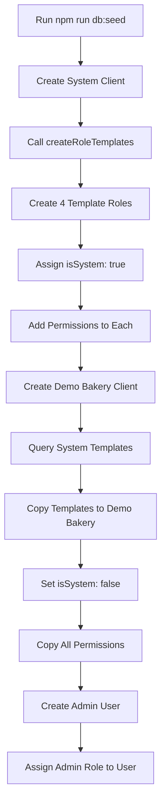

# Role Templates Implementation - Complete ✅

## 🎯 Overview

Successfully implemented a **Role Templates System** that ensures every new bakery client automatically gets standardized roles with proper permissions. This system eliminates manual role creation and ensures consistency across all clients.

## ✅ What Was Implemented

### 1. Role Templates in Seed Script

**File**: `backend/prisma/seed.ts`

Added `createRoleTemplates()` function that:
- Creates 4 standard role templates in System client
- Each template marked with `isSystem: true`
- Templates include all necessary permissions
- Automatically runs during seed process

**Template Roles Created:**

| Role | Permissions | Purpose |
|------|------------|---------|
| **Admin** | 33 | Full bakery operations + user management |
| **Sales Manager** | 14 | Customers & orders + view inventory |
| **Inventory Manager** | 12 | Raw materials & finished products |
| **Production Manager** | 12 | Recipes & production |

### 2. Automatic Template Copying

**File**: `backend/prisma/seed.ts` (lines 280-330)

When Demo Bakery client is created:
1. Queries System client for templates (`isSystem: true`)
2. Excludes "Super Admin" role (platform-only)
3. Creates copy of each template for the new client
4. Sets `isSystem: false` for client roles
5. Copies all permissions from template to new role

**Console Output:**
```
📋 Copying role templates to Demo Bakery...
   ✅ Copied role: Admin (33 permissions)
   ✅ Copied role: Sales Manager (14 permissions)
   ✅ Copied role: Inventory Manager (12 permissions)
   ✅ Copied role: Production Manager (12 permissions)
✅ Role templates copied to Demo Bakery
```

### 3. Admin User Gets Template Role

**File**: `backend/prisma/seed.ts` (lines 332-359)

- Queries for "Admin" role in Demo Bakery client
- Assigns `roleId` when creating admin user
- User now has proper permissions from template

**Before**: User had `role: 'ADMIN'` enum only (no permissions)
**After**: User has `roleId` linking to Admin role (33 permissions)

### 4. NPM Script for Template Management

**File**: `backend/package.json`

Added new script:
```json
"setup:role-templates": "tsx scripts/create-role-templates.ts"
```

**Usage:**
```bash
# Create/update role templates in System client
npm run setup:role-templates
```

### 5. Documentation

#### README.md Updated

Added comprehensive "Role Templates System" section:
- How templates work
- 4 standard templates listed
- Management commands
- Customization guide
- Links to full documentation

#### Verification Script

**File**: `backend/scripts/verify-role-templates.ts`

Created script to verify template system:
- Shows all templates in System client
- Shows copied roles in Demo Bakery
- Displays permission counts
- Explains how system works

**Run with:**
```bash
npx tsx backend/scripts/verify-role-templates.ts
```

## 🔄 How It Works

### Fresh Setup (Seed)



### New Client Creation (Production)

When a new client is created via API:
1. **clientController.ts** automatically queries System client
2. Finds all roles where `isSystem: true`
3. Excludes "Super Admin" role
4. Creates copies for new client with `isSystem: false`
5. Copies all role permissions
6. New client immediately has 4 working roles

## 📊 Verification Results

```
🏢 SYSTEM CLIENT - ROLE TEMPLATES:

📦 Admin (isSystem: true)
   Permissions: 33
   
📦 Inventory Manager (isSystem: true)
   Permissions: 12
   
📦 Production Manager (isSystem: true)
   Permissions: 12
   
📦 Sales Manager (isSystem: true)
   Permissions: 14
   
📦 Super Admin (isSystem: true)
   Permissions: 15
   [NOT copied to bakery clients]

🏪 DEMO BAKERY CLIENT - COPIED ROLES:

✅ Admin (isSystem: false)
   Permissions: 33
   
✅ Inventory Manager (isSystem: false)
   Permissions: 12
   
✅ Production Manager (isSystem: false)
   Permissions: 12
   
✅ Sales Manager (isSystem: false)
   Permissions: 14
```

## 🛠️ Maintenance

### Updating Templates

To change what permissions new clients get:

**Option 1: Edit Seed File**
1. Edit `createRoleTemplates()` in `backend/prisma/seed.ts`
2. Modify permissions array for any role
3. Run `npm run db:seed:force` to recreate

**Option 2: Edit Script**
1. Edit `backend/scripts/create-role-templates.ts`
2. Run `npm run setup:role-templates`

**Important**: Changes only affect NEW clients. Existing clients keep their current roles.

### Syncing Existing Clients

To update existing clients with new template permissions:

```bash
npx tsx backend/scripts/sync-clients-with-templates.ts
```

This will:
- Query all clients (except System)
- Update each client's roles to match templates
- Preserve custom roles clients may have added

## 📁 Files Modified

| File | Changes |
|------|---------|
| `backend/prisma/seed.ts` | Added `createRoleTemplates()` function, template copying logic, admin role assignment |
| `backend/package.json` | Added `setup:role-templates` script |
| `backend/scripts/verify-role-templates.ts` | NEW - verification script |
| `README.md` | Added "Role Templates System" section |

## 🎯 Benefits

1. **Consistency**: All new clients get same standardized roles
2. **No Manual Work**: Roles automatically created when client is created
3. **Centralized Management**: Edit templates in one place
4. **Clear Documentation**: Developers know exactly what roles exist
5. **Safe Updates**: Template changes don't affect existing clients
6. **Type Safety**: Templates live in code, not just database

## ✅ Testing Checklist

- [x] Seed creates templates in System client
- [x] Templates marked with `isSystem: true`
- [x] Templates have correct permission counts
- [x] Demo Bakery gets copies of templates
- [x] Copied roles have `isSystem: false`
- [x] All permissions copied correctly
- [x] Admin user assigned to Admin role
- [x] Super Admin role NOT copied to bakery clients
- [x] Verification script shows correct data
- [x] Documentation complete

## 🚀 Next Steps (Future Enhancement)

Consider these improvements:

1. **Role Template UI**: Super Admin page to edit templates via UI
2. **Template Versioning**: Track template changes over time
3. **Client Sync UI**: Button to sync existing clients with new templates
4. **Custom Templates**: Allow clients to create their own custom roles
5. **Permission Groups**: Group related permissions for easier management

## 📚 Related Documentation

- [ROLE_TEMPLATE_SYSTEM_COMPLETE.md](./ROLE_TEMPLATE_SYSTEM_COMPLETE.md) - Previous implementation details
- [SUPER_ADMIN_GUIDE.md](./SUPER_ADMIN_GUIDE.md) - Super Admin vs Bakery Admin
- [MULTI_TENANT_AUTH_PROMPT.md](./MULTI_TENANT_AUTH_PROMPT.md) - Original requirements
- [README.md](./README.md#-role-templates-system) - Quick reference

---

**Implementation Date**: December 13, 2025
**Status**: ✅ Complete and Tested
**Impact**: All new clients get standardized roles automatically
