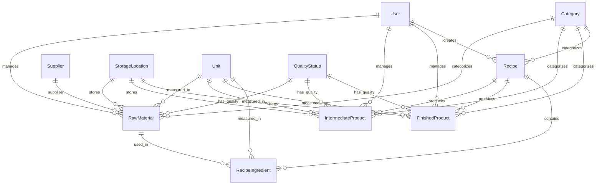

# Technical Architecture

## 🏗️ System Overview

```
┌─────────────────┐    ┌─────────────────┐    ┌─────────────────┐
│   Frontend      │    │    Backend      │    │   Database      │
│   (React TS)    │◄──►│  (Express TS)   │◄──►│  (PostgreSQL)   │
│   Material-UI   │    │   Prisma ORM    │    │   with Prisma   │
└─────────────────┘    └─────────────────┘    └─────────────────┘
```

## 🔧 Technology Stack

### Frontend Technologies

| Technology | Version | Purpose |
|------------|---------|---------|
| React | 18.2.0 | UI library for component-based development |
| TypeScript | 5.2.2 | Type-safe JavaScript |
| Material-UI | 5.14.16 | Component library with professional design system |
| React Query | 4.35.3 | Data fetching, caching, and state management |
| Vite | 4.5.0 | Build tool and development server |
| React Router | 6.18.0 | Client-side routing |
| date-fns | 2.30.0 | Date formatting and manipulation |
| Emotion | 11.11.0 | CSS-in-JS styling solution |

### Backend Technologies

| Technology | Version | Purpose |
|------------|---------|---------|
| Node.js | 18.17.0 | JavaScript runtime |
| Express.js | 4.18.2 | Web application framework |
| TypeScript | 5.2.2 | Type-safe JavaScript |
| Prisma | 5.4.2 | Database ORM and migration tool |
| PostgreSQL | 15.0 | Relational database |
| cors | 2.8.5 | Cross-origin resource sharing |
| dotenv | 16.3.1 | Environment variable management |

## 🗃️ Database Schema

### Core Entities

#### Users

```sql
User {
  id: String (Primary Key)
  email: String (Unique)
  password: String
  firstName: String
  lastName: String
  role: String
  createdAt: DateTime
  updatedAt: DateTime
}
```

#### Raw Materials

```sql
RawMaterial {
  id: String (Primary Key)
  name: String
  description: String?
  sku: String (Unique)
  categoryId: String (Foreign Key)
  supplierId: String (Foreign Key)
  unitId: String (Foreign Key)
  currentStock: Decimal
  minimumStock: Decimal
  maximumStock: Decimal
  costPerUnit: Decimal
  qualityStatus: String
  expirationDate: DateTime?
  storageLocationId: String (Foreign Key)
  isContaminated: Boolean
  contaminationReason: String?
  batchNumber: String?
  createdAt: DateTime
  updatedAt: DateTime
}
```

#### Intermediate Products

```sql
IntermediateProduct {
  id: String (Primary Key)
  name: String
  description: String?
  sku: String (Unique)
  categoryId: String (Foreign Key)
  unitId: String (Foreign Key)
  currentStock: Decimal
  minimumStock: Decimal
  maximumStock: Decimal
  costPerUnit: Decimal
  qualityStatus: String
  productionDate: DateTime?
  expirationDate: DateTime?
  storageLocationId: String (Foreign Key)
  isContaminated: Boolean
  contaminationReason: String?
  batchNumber: String?
  recipeId: String? (Foreign Key)
  createdAt: DateTime
  updatedAt: DateTime
}
```

#### Finished Products

```sql
FinishedProduct {
  id: String (Primary Key)
  name: String
  description: String?
  sku: String (Unique)
  categoryId: String (Foreign Key)
  unitId: String (Foreign Key)
  currentStock: Decimal
  minimumStock: Decimal
  maximumStock: Decimal
  costPerUnit: Decimal
  sellingPrice: Decimal
  qualityStatus: String
  productionDate: DateTime?
  expirationDate: DateTime?
  storageLocationId: String (Foreign Key)
  isContaminated: Boolean
  contaminationReason: String?
  batchNumber: String?
  reserved: Decimal (Deprecated)
  available: Decimal (Computed; reservations deprecated)
  recipeId: String? (Foreign Key)
  createdAt: DateTime
  updatedAt: DateTime
}
```

#### Recipes

```sql
Recipe {
  id: String (Primary Key)
  name: String
  description: String?
  categoryId: String (Foreign Key)
  instructions: String?
  prepTime: Int? (minutes)
  cookTime: Int? (minutes)
  servings: Int?
  costPerServing: Decimal? (Computed)
  createdAt: DateTime
  updatedAt: DateTime
}

RecipeIngredient {
  id: String (Primary Key)
  recipeId: String (Foreign Key)
  rawMaterialId: String (Foreign Key)
  quantity: Decimal
  unitId: String (Foreign Key)
  notes: String?
}
```

### Supporting Entities

#### Categories

```sql
Category {
  id: String (Primary Key)
  name: String (Unique)
  description: String?
  type: String (raw_material, intermediate_product, finished_product, recipe)
  createdAt: DateTime
  updatedAt: DateTime
}
```

#### Suppliers

```sql
Supplier {
  id: String (Primary Key)
  name: String (Unique)
  contactPerson: String?
  email: String?
  phone: String?
  address: String?
  notes: String?
  createdAt: DateTime
  updatedAt: DateTime
}
```

#### Storage Locations

```sql
StorageLocation {
  id: String (Primary Key)
  name: String (Unique)
  description: String?
  temperature: String? (room, cold, frozen)
  createdAt: DateTime
  updatedAt: DateTime
}
```

#### Units

```sql
Unit {
  id: String (Primary Key)
  name: String (Unique)
  symbol: String (Unique)
  category: String (weight, volume, count)
  description: String?
  conversionFactor: Decimal? (for unit conversions)
  createdAt: DateTime
  updatedAt: DateTime
}
```

#### Quality Statuses

```sql
QualityStatus {
  id: String (Primary Key)
  name: String (Unique)
  description: String?
  color: String? (hex color code)
  isActive: Boolean
  createdAt: DateTime
  updatedAt: DateTime
}
```

## 🔗 Entity Relationships



## 🏛️ Application Architecture

### Frontend Architecture

```
src/
├── components/          # Reusable UI components
│   ├── Auth/           # Authentication components
│   ├── Layout/         # Navigation and layout components
│   └── Settings/       # Configuration components
├── pages/              # Page components (route handlers)
├── services/           # API integration services
│   ├── realApi.ts      # Main API service (MANDATORY)
│   └── mockApi.ts      # Mock service (DO NOT USE)
├── hooks/              # Custom React hooks
├── store/              # State management
├── types/              # TypeScript type definitions
├── theme/              # Material-UI theme configuration
└── utils/              # Utility functions
```

### Backend Architecture

```
src/
├── controllers/        # Request handlers
├── routes/            # API route definitions
├── middleware/        # Express middleware
├── models/            # Data models (with Prisma)
├── services/          # Business logic services
├── types/             # TypeScript type definitions
└── utils/             # Utility functions

prisma/
├── schema.prisma      # Database schema definition
├── migrations/        # Database migration files
└── seed.ts           # Database seeding script
```

## 🔄 Data Flow

### Frontend to Backend

1. **User Action** → Component event handler
2. **API Call** → realApi.ts service function
3. **HTTP Request** → Express.js backend
4. **Route Handler** → Controller function
5. **Business Logic** → Service function
6. **Database Query** → Prisma ORM
7. **Response** → Back through the chain

### State Management

1. **Local State** → React hooks (useState, useEffect)
2. **Server State** → React Query for caching and synchronization
3. **Global State** → Context API for user authentication and theme
4. **Form State** → Local component state with validation

## 🛡️ Security Architecture

### Authentication

- JWT-based authentication (planned)
- Secure password hashing
- Session management
- Role-based access control (planned)

### Data Validation

- Frontend validation with TypeScript types
- Backend validation with Prisma schema
- Input sanitization
- SQL injection prevention (via Prisma ORM)

### API Security

- CORS configuration
- Request rate limiting (planned)
- Input validation middleware
- Error handling without data leakage

## 📊 Performance Architecture

### Database Optimization

- Proper indexing on frequently queried fields
- Optimized queries with Prisma
- Connection pooling
- Query result caching (planned)

### Frontend Optimization

- Code splitting with Vite
- Lazy loading of components
- Image optimization
- Bundle size optimization

### API Performance

- Efficient database queries
- Response compression
- Pagination for large datasets
- Caching strategies

## 🚀 Deployment Architecture

### Development Environment

- Frontend: Vite dev server (<http://localhost:3002>)
- Backend: Express.js server (<http://localhost:8000>)
- Database: Local PostgreSQL instance

### Production Environment (Planned)

- Frontend: Static site deployment (Vercel/Netlify)
- Backend: Node.js hosting (Railway/Heroku)
- Database: Managed PostgreSQL (Railway/Supabase)
- CDN for static assets
- Environment-based configuration

## 🔧 Development Tools

### Code Quality

- TypeScript for type safety
- ESLint for code linting
- Prettier for code formatting
- Husky for git hooks (planned)

### Testing

- Node.js custom test scripts for API testing
- Jest for unit testing (planned)
- React Testing Library for component testing (planned)

### Database Management

- Prisma Studio for database inspection
- Migration management with Prisma
- Seeding scripts for test data

This architecture ensures scalability, maintainability, and performance while following industry best practices.
